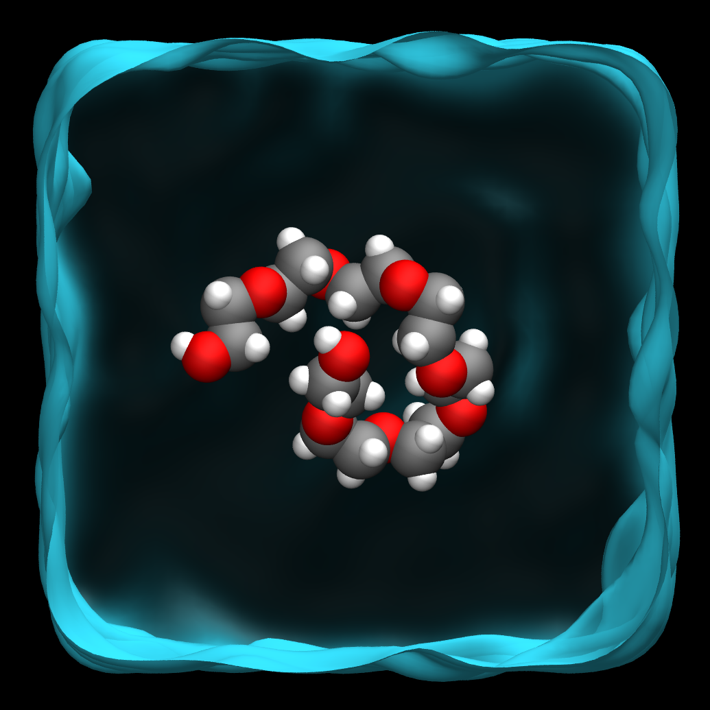
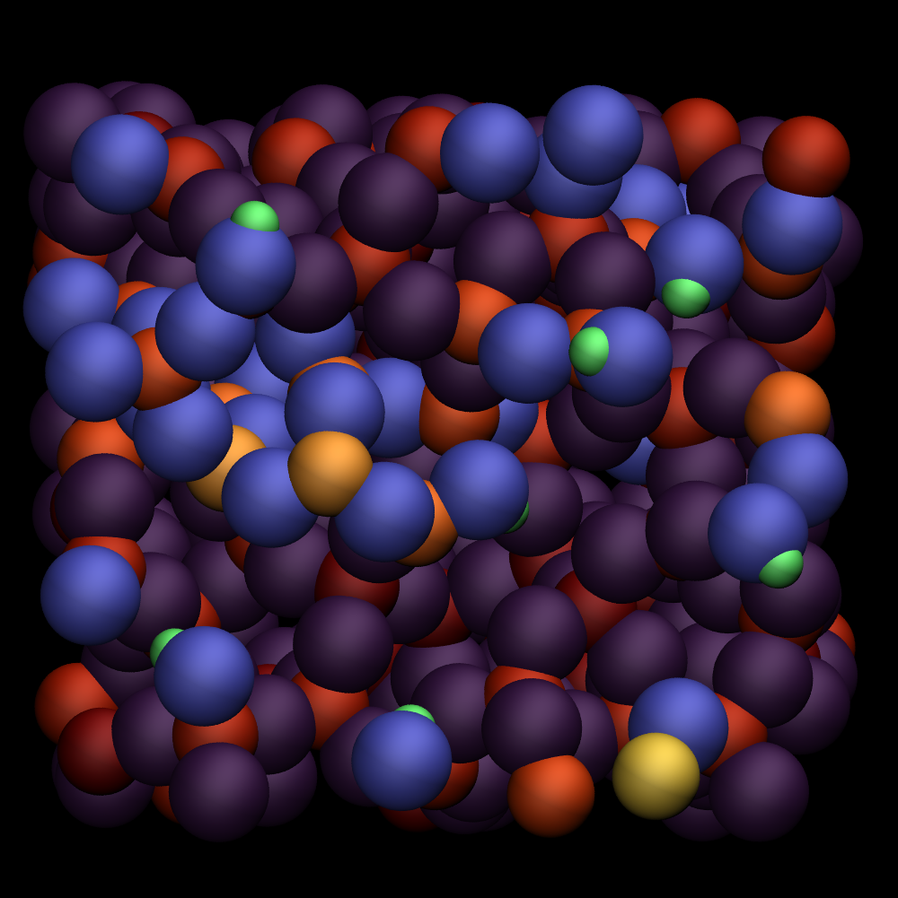
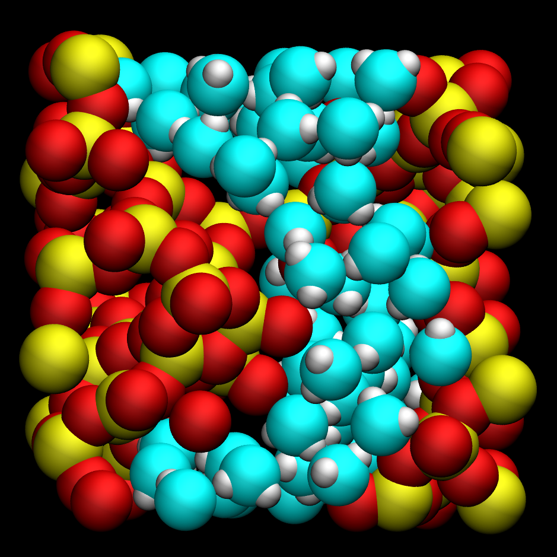
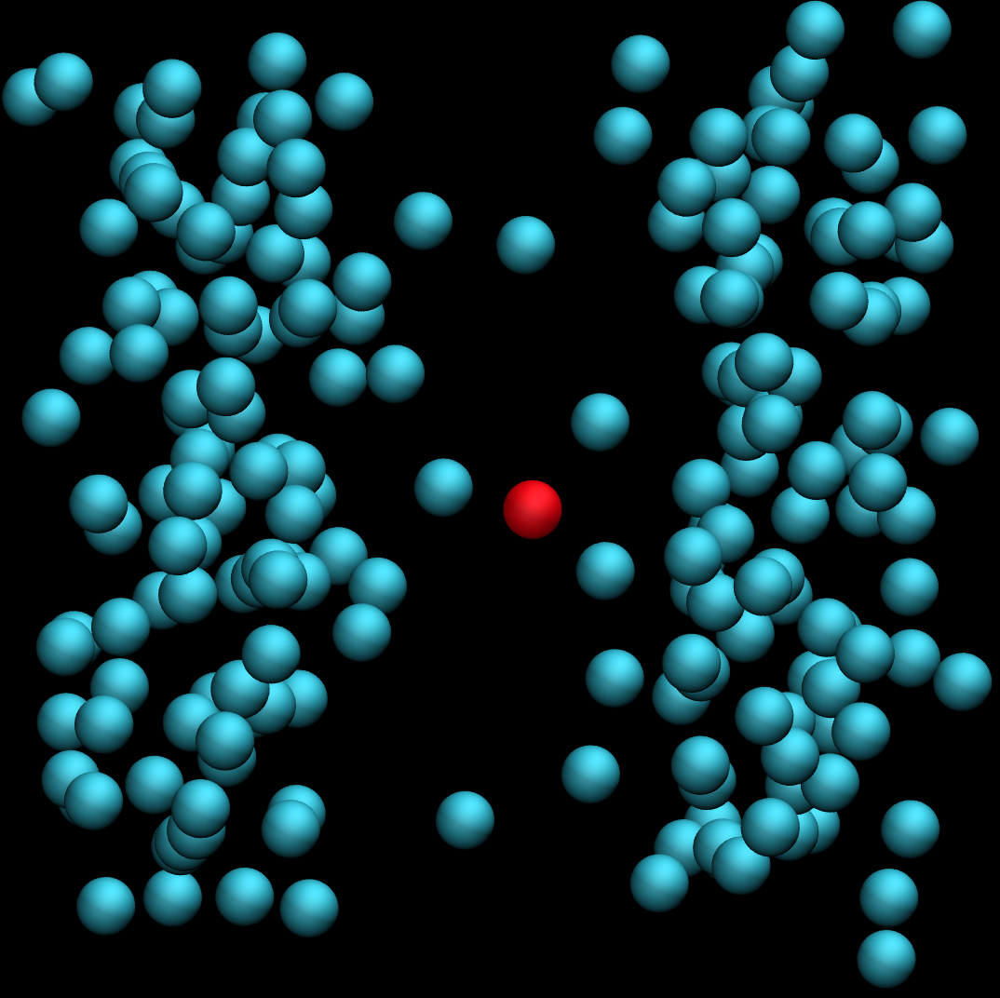
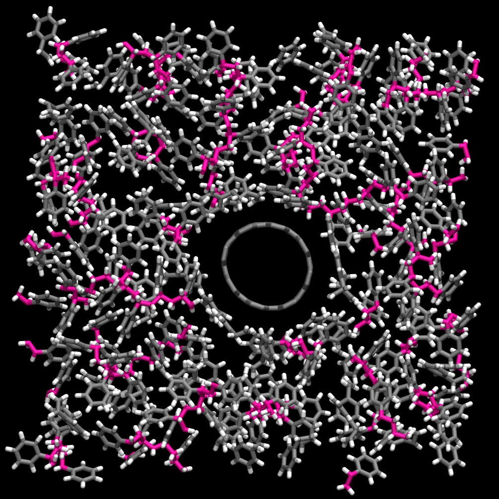

# LAMMPS tutorials logo and avatars

The repository contains the script for generating LAMMPS
tutorials avatars and logos.

    
    
    
    
    
    
    
    
    

## Rules for VMD images

By default, material parameters for images generated with VMD use
Ambiant=0.17, Diffuse=0.56, Specular=0.12, and Shininess=0.29.  
