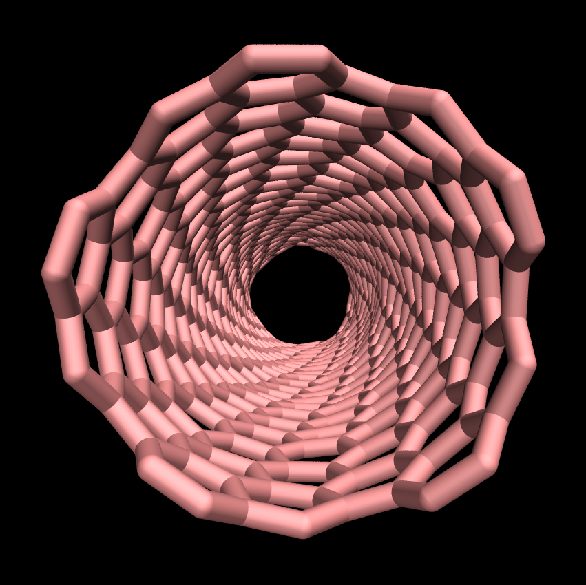

<!--
WARNING: DO NOT MODIFY DIRECTLY THE README.md!
This README.md file was assembled using the sed command from the files listed in
"files.txt". See the script in "generateREADME.sh". To modify the content of 
the  README.md, modify the files listed in "files.txt", or add a new file to the
list in "files.txt".
-->

# LAMMPS tutorials logo and avatars

The repository contains the script for generating LAMMPS
tutorials avatars and logos.

    
    
    
    
    

## Rules for VMD images

By default, material parameters for images generated with VMD use
Ambiant=0.17, Diffuse=0.56, Specular=0.12, and Shininess=0.29.  

## Authors

- [Simon Gravelle](https://github.com/simongravelle) (corresponding author),
  Univ. Grenoble Alpes, CNRS, LIPhy, 38000 Grenoble, France
- [Jacob R. Gissinger](https://www.stevens.edu/profile/jgissing),
  Stevens Institute of Technology, Hoboken, NJ 07030, USA
- [Axel Kohlmeyer](https://sites.google.com/site/akohlmey),
  Institute for Computational Molecular Science, Temple University, Philadelphia,
  PA 19122, USA

## Acknowledgements

- Simon Gravelle acknowledges funding from the European Union's Horizon 2020
  research and innovation programme under the Marie Skłodowska-Curie grant
  agreement No 101065060.
- Axel Kohlmeyer acknowledges financial support by Sandia National Laboratories
  under POs 2149742 and 2407526.

